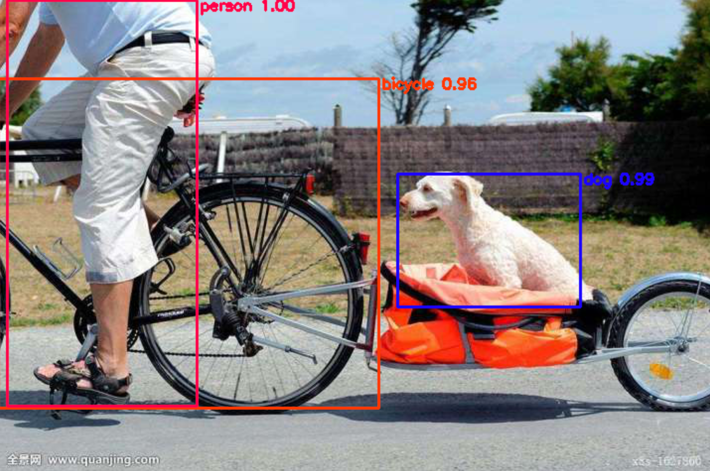

# xyolo

`xyolo`是一个Python实现的、高度封装的YOLO v3类库。

借助xyolo，您可以只使用几行Python代码轻松完成yolo3目标检测任务的训练和调用。

xyolo is a highly encapsulated YOLO v3 library implemented in Python.

With xyolo, you can easily complete the training and calling of the yolo3 target detection task with just a few lines of Python code.


请注意：

> 我使用的Python是Anaconda的Python 3.7发行版本，在shell里面进行了初始化(python和pip默认指向当前激活环境，而不是默认的python2)，所以文章中的python和pip请根据自己的情况判断是否需要替换为python3和pip3。

PS:

> 此项目是对[tf2-keras-yolo3](https://github.com/AaronJny/tf2-keras-yolo3)项目的重构和封装。


## 一、安装

### 1、通用安装方法

`xyolo`的安装非常简单，通过pip一键安装即可。请注意，`xyolo`需要安装的TensorFlow版本>=2.2（未安装TensorFlow的话则会自动安装）

```
pip install --user xyolo
```

建议使用`--user`参数，避免遇到权限问题。

当然，如果有条件的话，使用conda创建一个新环境，并在新环境中进行安装会更好，可以避免意料之外的依赖冲突问题。

### 2、GPU版本安装方法

如果你想使用TensorFlow的GPU版本，可以选择在安装xyolo之前，先安装2.2及以上的tensorflow-gpu。以conda举例，安装GPU支持的操作流程如下：

#### 1.创建一个虚拟环境，名为xyolo。

```
conda create -n xyolo python=3.7
```

#### 2.切换到刚创建好的环境里

```
conda activate xyolo
```

切换完成后，可以通过pip查看一下环境里安装的包：

```
pip list
```

结果不出预料，很干净，毕竟是一个新环境嘛：

```
Package    Version
---------- -------------------
certifi    2020.6.20
pip        20.2.4
setuptools 50.3.0.post20201006
wheel      0.35.1
```

#### 3.在新环境中安装tensorflow-gpu

> 注意，安装前需要先安装好和tensorflow版本对应的显卡驱动，这部分还有点麻烦，就不在这篇文章中说明了，我觉得会选择使用GPU跑xyolo的同学应该都已经掌握了这部分技能了吧？
>
> 毕竟如果完全没有接触过tensorflow-gpu的话，接触xyolo应该也会选择cpu版本更好上手。

我们通过conda来安装tensorflow-gpu，gpu版本的tensorflow存在cuda和cudnn依赖，使用conda可以自动解决这两者的版本依赖和配置问题。

```
conda install tensorflow-gpu=2.2
```

安静地等待一段时间，即可完成tensorflow-gpu的安装。

#### 4.使用pip安装xyolo

```
pip install --user xyolo
```

通过再次执行`pip list`，我们能够看到成功安装的xyolo及相关依赖。

```
Package                Version
---------------------- -------------------
absl-py                0.11.0
aiohttp                3.6.3
astunparse             1.6.3
async-timeout          3.0.1
attrs                  20.2.0
blinker                1.4
brotlipy               0.7.0
cachetools             4.1.1
certifi                2020.6.20
cffi                   1.14.3
chardet                3.0.4
click                  7.1.2
cryptography           3.1.1
cycler                 0.10.0
gast                   0.3.3
google-auth            1.23.0
google-auth-oauthlib   0.4.2
google-pasta           0.2.0
grpcio                 1.31.0
h5py                   2.10.0
idna                   2.10
importlib-metadata     2.0.0
Keras-Preprocessing    1.1.0
kiwisolver             1.3.1
loguru                 0.5.3
lxml                   4.6.1
Markdown               3.3.2
matplotlib             3.3.2
mkl-fft                1.2.0
mkl-random             1.1.1
mkl-service            2.3.0
multidict              4.7.6
numpy                  1.18.5
oauthlib               3.1.0
opencv-python          4.4.0.46
opt-einsum             3.1.0
Pillow                 8.0.1
pip                    20.2.4
protobuf               3.13.0
pyasn1                 0.4.8
pyasn1-modules         0.2.8
pycparser              2.20
PyJWT                  1.7.1
pyOpenSSL              19.1.0
pyparsing              2.4.7
PySocks                1.7.1
python-dateutil        2.8.1
requests               2.24.0
requests-oauthlib      1.3.0
rsa                    4.6
scipy                  1.4.1
setuptools             50.3.0.post20201006
six                    1.15.0
tensorboard            2.2.2
tensorboard-plugin-wit 1.6.0
tensorflow             2.2.0
tensorflow-estimator   2.2.0
termcolor              1.1.0
tqdm                   4.51.0
urllib3                1.25.11
Werkzeug               1.0.1
wheel                  0.35.1
wrapt                  1.12.1
xyolo                  0.1.3
yarl                   1.6.2
zipp                   3.4.0
```


## 二、使用方法

### 1、使用官方预训练权重，进行目标检测测试

yolov3官方有提供预训练权重，如果我们要在和VOC数据集同分布或相似分布的图片上做目标检测的话，直接使用官方预训练权重也是可以的。

xyolo调用官方预训练模型的逻辑是：

- 1.从官网下载预训练权重（Darknet输出格式）
- 2.将Darknet的权重文件转成keras的权重文件（现在TensorFlow和Keras已经基本不分家啦）
- 3.构建模型，加载预训练权重
- 4.对选择的图片进行目标检测

好麻烦啊，是不是要写很多代码？当然不是~歪嘴.jpg


首先，准备一张用于检测的图片，假设它的路径是`./xyolo_data/detect.jpg`，图片内容如下：


一个简单的示例如下：

```python
# 导入包
from xyolo import YOLO, DefaultYolo3Config
from xyolo import init_yolo_v3


# 创建默认配置类对象
config = DefaultYolo3Config()
# 初始化xyolo（下载预训练权重、转换权重等操作都是在这里完成的）
# 下载和转换只在第一次调用的时候进行，之后再调用会使用缓存的文件
init_yolo_v3(config)
# 创建一个yolo对象，这个对象提供使用yolov3进行检测和训练的接口
yolo = YOLO(config)

# 检测并在图片上标注出物体
img = yolo.detect_and_draw_image('./xyolo_data/detect.jpg')
# 展示标注后图片
img.show()
```

输出如下:

```
2020-11-03 23:33:49.645 | DEBUG    | xyolo.yolo3.yolo:detect_image:273 - Found 3 boxes for img
2020-11-03 23:33:49.648 | DEBUG    | xyolo.yolo3.yolo:detect_image:289 - Class dog 0.99,Position (402, 176), (586, 310)
2020-11-03 23:33:49.650 | DEBUG    | xyolo.yolo3.yolo:detect_image:289 - Class bicycle 0.96,Position (0, 80), (383, 412)
2020-11-03 23:33:49.652 | DEBUG    | xyolo.yolo3.yolo:detect_image:289 - Class person 1.00,Position (9, 1), (200, 410)
2020-11-03 23:33:49.652 | DEBUG    | xyolo.yolo3.yolo:detect_image:292 - Cost time 6.65432205500838s
```

同时，打开了一张图片（图片尺寸不一致是我截图和排版的问题）：



这样，一次目标检测就完成了，舒服呀~

当然了，我相信肯定有不少同学已经在这段代码的执行过程中遇到困难或疑惑了，我来集中解答几个可能会遇到的。

1.预训练权重下载慢或无法下载

> 因为yolov3的官网在国外，所以国内下载慢也很正常。推荐使用代理，或从备份地址下载后指定预训练权重的地址。具体方法参考`2、预训练权重无法下载或下载速度慢的解决方案`。

2.提示权限问题

> 因为xyolo会自动下载预训练权重到安装目录下，在某些情况下可能会遇到权限问题。解决方法就是在安装部分说的，通过指定`--user`参数指明将包安装在用户目录下，一般就没问题了。

3.检测的速度慢

> 细心的同学可能发现了，上面对图片做的一次检测，竟然花了6秒！这也太慢了吧？
>
> 事实上，并不是这样的。TensorFlow 2.x版本，默认使用动态图，性能会稍弱于1.x的静态图。所以，我这里使用了tf.function对速度进行了优化，在第一次运算时，模型会自动生成静态图，这部分会比较消耗时间，但后续单次计算的时间都会极大地缩短。
>
> 假如我们接着进行几次识别，就能够发现单次识别的时间有了明显降低，一般只需要零点几秒或几十毫秒。

### 2、预训练权重无法下载或下载速度慢的解决方案

主要有两种方法能够解决，分别看一下。

#### 1.设置代理

如果我们手上有能够加快访问速度的网络代理（你应该知道我在说啥~），可以通过设置代理的形式加快下载速度，示例如下：

```python
from xyolo import YOLO, DefaultYolo3Config
from xyolo import init_yolo_v3

# 创建一个DefaultYolo3Config的子类，在子类里覆盖默认的配置
class MyConfig(DefaultYolo3Config):
    def __init__(self):
        super(MyConfig, self).__init__()
        # 这是替换成你的代理地址
        self.requests_proxies = {'https': 'http://localhost:7890'}
        
# 使用修改后的配置创建yolo对象
config = MyConfig()
init_yolo_v3(config)
yolo = YOLO(config)

# 检测
img = yolo.detect_and_draw_image('./xyolo_data/detect.jpg')
img.show()
```

#### 2.从备用链接手动下载

如果没有代理的话，也可以选择从备用下载地址下载。

我把预训练权重上传到百度云上了，链接如下：

>  链接: https://pan.baidu.com/s/1jXpoXHQHlp6Ra0jImruPXg  密码: 48ed

从分享页面下载好权重文件后，又有两种设置方式。

①将文件复制到xyolo包的安装目录下的xyolo_data目录下即可，就和自动下载的情况是一样的，后续不需要再人为做任何操作。

②将文件保存在任意位置，并在配置类中设置它的路径。

第一种就不需要多说了，来看一个第二种设置方法的示例：

```python
from xyolo import YOLO, DefaultYolo3Config
from xyolo import init_yolo_v3

# 创建一个DefaultYolo3Config的子类，在子类里覆盖默认的配置
class MyConfig(DefaultYolo3Config):
    def __init__(self):
        super(MyConfig, self).__init__()
        # 这是替换成你的文件路径，为了避免出错，请尽量使用绝对路径
        self._pre_training_weights_darknet_path = '/Users/aaron/data/darknet_yolo.weights'
        
# 使用修改后的配置创建yolo对象
config = MyConfig()
init_yolo_v3(config)
yolo = YOLO(config)

# 检测
img = yolo.detect_and_draw_image('./xyolo_data/detect.jpg')
img.show()
```

### 3、使用自己的数据训练模型

首先介绍一下xyolo的数据集的输入格式。xyolo的输入数据集可表示如下：

> 数据集是一个txt文本文件，它包含若干行，每行是一条数据。
>
> 每一行的格式： 图片路径 box1 box2 ... boxN
>
> 每一个box的格式：框框左上角x值,框框左上角y值,框框右下角x值,框框右下角y值,框框内物体的类别编号
>
> 给出一个示例：
>
> > ```
> > path/to/img1.jpg 50,100,150,200,0 30,50,200,120,3
> > path/to/img2.jpg 120,300,250,600,2
> > ...
> > ```

进行图像标注的工具，labelImg算是用的比较多的。labelImg的标注文件格式默认是VOC的格式，文件类型是xml，与xyolo的输入格式并不相同。不用担心，xyolo提供了一个数据格式转换的脚本，我们只需要调用即可。

```python
# 引入转换脚本
from xyolo import voc2xyolo

# voc格式的标注数据路径的正则表达式
input_path = '/Users/aaron/data/labels_voc/*.xml'
# classes是我们要检测的所有有效类别名称构成的txt文件，每个类别一行
classes_path = '/Users/aaron/code/xyolo/tests/xyolo_data/classes.txt'
# 转换后的xyolo数据集存放路径
output_path = '/Users/aaron/code/xyolo/tests/xyolo_data/xyolo_label.txt'
# 开始转换
voc2xyolo(input_path=input_path, classes_path=classes_path, output_path=output_path)
```

脚本执行后，会有进度条提示处理进度，当进度条达到100%时，处理完成。

```
100%|██████████| 106/106 [00:00<00:00, 3076.05it/s]
```

有了数据集之后，可以准备训练了。在此之前，确认一遍我们需要的东西：

- xyolo支持的数据集
- 要检测的所有有效类别名称构成的txt文件（`classes.txt`）

我以检测某个网站的验证码图片上的文字举例。

首先确定要检测的类别，我只需要判断字的位置，不判断每个字是什么，所以就一个类别text。我们创建一个`classes.txt`文件，在里面写入：

```
text
```

然后，我标注并使用xyolo转换了数据集(`xyolo_label.txt`)：

```
/home/aaron/tmp/test_xyolo/images/162.png 47,105,75,141,0 157,52,181,80,0 197,85,229,120,0 265,85,296,117,0 257,131,293,166,0 355,63,386,90,0
/home/aaron/tmp/test_xyolo/images/88.png 93,46,129,86,0 79,139,114,174,0 209,42,237,72,0 200,68,226,98,0 256,53,295,86,0 209,134,247,171,0
/home/aaron/tmp/test_xyolo/images/176.png 43,88,76,120,0 123,91,153,127,0 98,155,127,184,0 189,117,224,152,0 289,54,319,86,0 348,123,374,151,0
/home/aaron/tmp/test_xyolo/images/63.png 36,128,72,161,0 79,130,104,161,0 127,120,160,153,0 305,111,329,138,0 302,125,334,153,0 342,81,380,119,0
/home/aaron/tmp/test_xyolo/images/77.png 164,114,200,150,0 193,147,225,182,0 309,90,336,120,0 349,89,382,121,0 321,126,352,155,0 298,150,327,177,0
/home/aaron/tmp/test_xyolo/images/189.png 119,90,148,118,0 122,132,150,159,0 208,44,240,76,0 279,60,314,97,0 299,65,334,98,0 331,93,364,129,0
/home/aaron/tmp/test_xyolo/images/200.png 232,58,265,91,0 288,58,316,85,0 49,118,78,148,0 55,134,83,163,0 75,148,103,175,0 312,131,343,163,0
/home/aaron/tmp/test_xyolo/images/76.png 20,61,56,97,0 29,108,57,139,0 76,117,111,154,0 139,117,167,147,0 204,116,242,157,0 336,153,376,191,0
...
```

开始训练：

```python
# 导入包
from xyolo import DefaultYolo3Config, YOLO
from xyolo import init_yolo_v3

# 创建一个DefaultYolo3Config的子类，在子类里覆盖默认的配置
class MyConfig(DefaultYolo3Config):
    def __init__(self):
        super(MyConfig, self).__init__()
        # 数据集路径，推荐使用绝对路径
        self._dataset_path = '/home/aaron/tmp/test_xyolo/xyolo_data/yolo_label.txt'
        # 类别名称文件路径，推荐使用绝对路径
        self._classes_path = '/home/aaron/tmp/test_xyolo/xyolo_data/classes.txt'
        # 模型保存路径，默认是保存在当前路径下的xyolo_data下的，也可以进行更改
        # 推荐使用绝对路径
        self._output_model_path = '/home/aaron/tmp/test_xyolo/output_model.h5'
        

# 使用修改后的配置创建yolo对象
config = MyConfig()
init_yolo_v3(config)
# 如果是训练，在创建yolo对象时要传递参数train=True
yolo = YOLO(config, train=True)
# 开始训练，训练完成后会自动保存
yolo.fit()
```

如果想要使用训练好的模型进行预测，可以这样写：

```python
# 导入包
from xyolo import DefaultYolo3Config, YOLO
from xyolo import init_yolo_v3

# 创建一个DefaultYolo3Config的子类，在子类里覆盖默认的配置
class MyConfig(DefaultYolo3Config):
    def __init__(self):
        super(MyConfig, self).__init__()
        # 类别名称文件路径，推荐使用绝对路径
        self._classes_path = '/home/aaron/tmp/test_xyolo/xyolo_data/classes.txt'
        # yolo对象使用的模型路径，也就是刚刚训练好的模型路径，推荐使用绝对路径
        self._model_path = '/home/aaron/tmp/test_xyolo/output_model.h5'
        

# 使用修改后的配置创建yolo对象
config = MyConfig()
init_yolo_v3(config)
yolo = YOLO(config)
# 检测
img = yolo.detect_and_draw_image('./xyolo_data/detect.jpg')
img.show()
```

觉得反复配置Config类麻烦？实际上，对于一个项目，我们只需要配置一个Config类，把项目用到的配置都一起配置了，然后再引用同一个类即可，我现在这么写只是为了方便演示。比如上面这个，可以直接把训练和调用的配置写在一起：

```python
# 创建一个DefaultYolo3Config的子类，在子类里覆盖默认的配置
class MyConfig(DefaultYolo3Config):
    def __init__(self):
        super(MyConfig, self).__init__()
        # 数据集路径，推荐使用绝对路径
        self._dataset_path = '/home/aaron/tmp/test_xyolo/xyolo_data/yolo_label.txt'
        # 类别名称文件路径，推荐使用绝对路径
        self._classes_path = '/home/aaron/tmp/test_xyolo/xyolo_data/classes.txt'
        # 模型保存路径，默认是保存在当前路径下的xyolo_data下的，也可以进行更改
        # 推荐使用绝对路径
        self._output_model_path = '/home/aaron/tmp/test_xyolo/output_model.h5'
				# yolo对象使用的模型路径，也就是刚刚训练好的模型路径，推荐使用绝对路径
        self._model_path = '/home/aaron/tmp/test_xyolo/output_model.h5'
```

### 4、可选的全部配置项

我决定在`xyolo`工具里面给用户足够的定制空间，所以参数会设置的比较多，这样使用起来会更加灵活。

但也不用担心配置繁琐，因为如上面所见，其实常用的配置项就几个，只要掌握那几个就可以轻松上手了。但是如果想更灵活的话，就需要了解更多参数。下面给出一份完整的参数配置信息（也就是xyolo的默认配置）：

```python
from os.path import abspath, join, dirname, exists
from os import mkdir


class DefaultYolo3Config:
    """
    yolo3模型的默认设置
    """

    def __init__(self):
        # xyolo各种数据的保存路径，包内置
        self.inner_xyolo_data_dir = abspath(join(dirname(__file__), './xyolo_data'))
        # xyolo各种数据的保存路径，包外，针对于项目
        self.outer_xyolo_data_dir = abspath('./xyolo_data')
        # yolo3预训练权重下载地址
        self.pre_training_weights_url = 'https://pjreddie.com/media/files/yolov3.weights'
        # 下载文件时的http代理，
        # 如需设置，格式为{'https_proxy':'host:port'}，如{'https_proxy':'http://127.0.0.1:7890'},
        # 详细设置请参考 https://requests.readthedocs.io/en/master/user/advanced/#proxies
        self.requests_proxies = None
        # Darknet格式的预训练权重路径,请填写相对于inner_xyolo_data_dir的相对或绝对路径
        self._pre_training_weights_darknet_path = 'darknet_yolo.weights'
        # yolo3预训练权重darknet md5 hash值，用于处理异常数据
        self.pre_training_weights_darknet_md5 = 'c84e5b99d0e52cd466ae710cadf6d84c'
        # 转化后的、Keras格式的预训练权重路径，请填写相对于inner_xyolo_data_dir的相对或绝对路径
        self._pre_training_weights_keras_path = 'keras_weights.h5'
        # 预训练权重的配置路径，请填写相对于inner_xyolo_data_dir的相对或绝对路径
        self._pre_training_weights_config_path = 'yolov3.cfg'
        # 默认的anchors box路径，请填写相对于inner_xyolo_data_dir的相对或绝对路径
        self._anchors_path = 'yolo_anchors.txt'
        # 默认的类别文本路径，请填写相对于inner_xyolo_data_dir的相对或绝对路径
        self._classes_path = 'coco_classes.txt'
        # 训练输出的模型地址,请填写相对于outer_xyolo_data_dir的相对或绝对路径
        self._output_model_path = 'output_model.h5'
        # 数据集路径,请填写相对于outer_xyolo_data_dir的相对或绝对路径
        self._dataset_path = 'dataset.txt'
        # 是否开启TensorBoard，默认开启
        self.use_tensorboard = True
        # 训练时TensorBoard输出路径，请填写相对于outer_xyolo_data_dir的相对或绝对路径
        self._tensorboard_log_path = './tensorboard/logs'
        # 是否开启CheckPoint，默认开启
        self.use_checkpoint = True
        # 是否开启学习率衰减
        self.use_reduce_lr = True
        # 学习率衰减监控指标，默认为验证loss
        self.reduce_lr_monitor = 'val_loss'
        # 学习率衰减因子，new_lr = lr * factor
        self.reduce_lr_factor = 0.1
        # 连续patience个epochs内结果未改善，则进行学习率衰减
        self.reduce_lr_patience = 3
        # 是否开启early_stopping
        self.use_early_stopping = True
        # early_stopping监控指标，默认为验证loss
        self.early_stopping_monitor = 'val_loss'
        # 指标至少变化多少认为结果改善了
        self.early_stopping_min_delta = 0
        # 连续patience个epochs内结果未改善，则提前结束训练
        self.early_stopping_patience = 10
        # yolo默认加载的模型路径(最好填写绝对路径)，优先级设置见下方model_path方法
        self._model_path = ''
        # 目标检测分数阈值
        self.score = 0.3
        # 交并比阈值
        self.iou = 0.45
        # 模型图片大小
        self.model_image_size = (416, 416)
        # GPU数量
        self.gpu_num = 1
        # 训练时的验证集分割比例，默认为0.1，
        # 即将数据集中90%的数据用于训练，10%的用于测试
        self.val_split = 0.1
        # 训练分为两步，第一步冻结大多数层进行训练，第二步解冻进行微调
        # 是否开启冻结训练，建议开启
        self.frozen_train = True
        # 冻结时，训练的epoch数
        self.frozen_train_epochs = 50
        # 冻结时，训练的batch_size
        self.frozen_batch_size = 32
        # 冻结时的初始学习率
        self.frozen_lr = 1e-3
        # 是否开启解冻训练，建议开启
        self.unfreeze_train = True
        # 解冻时，训练的epoch数
        self.unfreeze_train_epochs = 50
        # 解冻时，训练的batch_size.注意，解冻时训练对GPU内存需求量非常大，这里建议设置小一点
        self.unfreeze_batch_size = 1
        # 解冻时的初始学习率
        self.unfreeze_lr = 1e-4

    def __setattr__(self, key, value):
        _key = '_{}'.format(key)
        if key not in self.__dict__ and _key in self.__dict__:
            self.__dict__[_key] = value
        else:
            self.__dict__[key] = value

    @classmethod
    def make_dir(cls, path):
        if not exists(path):
            mkdir(path)

    @classmethod
    def join_and_abspath(cls, path1, path2):
        return abspath(join(path1, path2))

    def inner_abspath(self, filename):
        self.make_dir(self.inner_xyolo_data_dir)
        return self.join_and_abspath(self.inner_xyolo_data_dir, filename)

    def outer_abspath(self, filename):
        self.make_dir(self.outer_xyolo_data_dir)
        return self.join_and_abspath(self.outer_xyolo_data_dir, filename)

    @property
    def pre_training_weights_darknet_path(self):
        return self.inner_abspath(self._pre_training_weights_darknet_path)

    @property
    def pre_training_weights_config_path(self):
        return self.inner_abspath(self._pre_training_weights_config_path)

    @property
    def pre_training_weights_keras_path(self):
        return self.inner_abspath(self._pre_training_weights_keras_path)

    @property
    def anchors_path(self):
        return self.inner_abspath(self._anchors_path)

    @property
    def classes_path(self):
        return self.inner_abspath(self._classes_path)

    @property
    def output_model_path(self):
        return self.outer_abspath(self._output_model_path)

    @property
    def dataset_path(self):
        return self.outer_abspath(self._dataset_path)

    @property
    def tensorboard_log_path(self):
        return self.outer_abspath(self._tensorboard_log_path)

    @property
    def model_path(self):
        """
        Yolo模型默认加载的权重的路径。
        按照 _model_path > output_model_path > pre_training_weights_keras_path 的优先级选择，即：
        如果设置了_model_path,选择_model_path
        否则，如果设置了output_model_path且路径存在，选择output_model_path
        否则，选择pre_training_weights_keras_path
        """
        _model_path = getattr(self, '_model_path', '')
        if _model_path:
            return abspath(_model_path)
        if self._output_model_path and exists(self.output_model_path):
            return self.output_model_path
        return self.pre_training_weights_keras_path

```

配置项都有注释说明，就不再多讲了。这里我还想提一下`model_path`这个`property`。


`model_path`决定了xyolo在进行检测时，会加载那个模型文件。它的选择逻辑如下：

按照 `_model_path` > `output_model_path` > `pre_training_weights_keras_path` 的优先级选择，即：

- 如果设置了`_model_path`,选择`_model_path`(`3、使用自己的数据训练模型`中检测部分就是这种情况)
- 否则，如果设置了`output_model_path`且路径存在，选择`output_model_path`（也就是说，因为设置了`_output_model_path`，所以假设`3、使用自己的数据训练模型`中没配置`model_path`，它在检测时也能够正确加载模型）
- 否则，选择`pre_training_weights_keras_path` (也就是转换后的官方预训练模型，即`1、使用官方预训练权重，进行目标检测测试` 中的情况)


### 5、yolo对象的几个常用方法

上面几个检测示例中，我们调用的都是同一个方法：

```python
img = yolo.detect_and_draw_image('./xyolo_data/detect.jpg')
img.show()
```

它的输入是一个PIL.Image.Image类的实例，或者一个表示图片路径的字符串，返回的是检测并画上框框标记的图片对象，也是PIL.Image.Image类的实例。

看一下它的代码：

```python
    def detect_and_draw_image(self, image: typing.Union[Image.Image, str], draw_label=True) -> Image.Image:
        """
        在给定图片上做目标检测，并根据检测结果在图片上画出框框和标签

        Args:
            image: 要检测的图片对象（PIL.Image.Image）或路径(str)
            draw_label: 是否需要为框框标注类别和概率

        Returns:
            添加了检测结果的图片对象
        """
        predicted_results = self.detect_image(image)
        img = self.draw_image(image, predicted_results, draw_label=draw_label)
        return img
```

可以看到，这个方法实际上是调用了两个方法，`detect_image`用来获取检测结果，`draw_image`用来在图片上绘制检测信息。

如果需要的话，我们也可以直接调用这两个方法，比如当我只需要获取图片上的目标检测结果时，我只需要调用`detect_image`即可，因为我并不关心图片的绘制。

下面附上这两个方法的接口说明：

```python
    def detect_image(self, img: typing.Union[Image.Image, str]) -> typing.List[
            typing.Tuple[str, int, float, int, int, int, int]]:
        """
        在给定图片上做目标检测并返回检测结果

        Args:
            img: 要检测的图片对象（PIL.Image.Image）或路径(str)

        Returns:
            [[类别名称,类别编号,概率,左上角x值,左上角y值,右下角x值,右下角y值],...]
        """
      	pass
      
     
    def draw_image(self, img: typing.Union[Image.Image, str], predicted_results: typing.List[
      typing.Tuple[str, int, float, int, int, int, int]], draw_label=True) -> Image.Image:
        """
        给定一张图片和目标检测结果，将目标检测结果绘制在图片上，并返回绘制后的图片

        Args:
            img: 要检测的图片对象（PIL.Image.Image）或路径(str)
            predicted_results: 目标检测的结果，[[类别名称,类别编号,概率,左上角x值,左上角y值,右下角x值,右下角y值],...]
            draw_label: 是否需要为框框标注类别和概率

        Returns:
            添加了检测结果的图片对象
        """
        pass
```


## 后话

xyolo包还没有进行过充足的测试（我自己做过使用测试，但很明显，不能覆盖到全部的情况），所以出个什么bug也是可以理解的吧（别打我，别打我，抱头）？碰到什么bug的话欢迎联系我哈。

PS:

> xyolo最低支持的TensorFlow版本是2.2，更低版本的没有测试和适配，不保证能用。精力有限，所以低版本也不打算适配了，所以如果是低版本导致的问题，我可能就不做处理了，请见谅~

最后，如果您喜欢这个项目的话，给个star呗~

感谢支持~